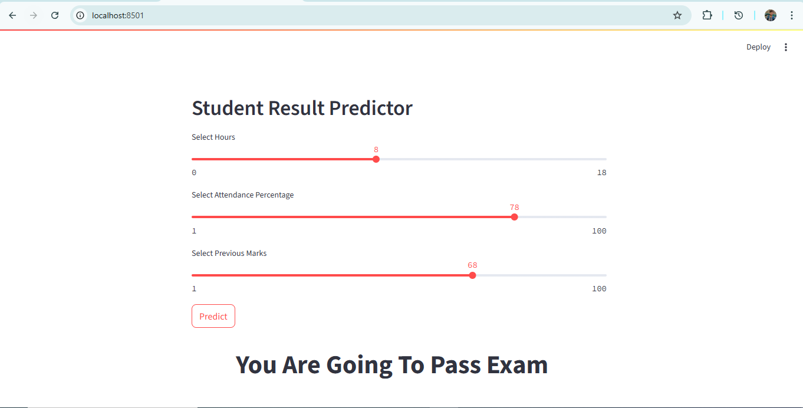

Student Result Prediction
📌 Algorithm: Logistic Regression
🖼️ Image: 

📖 Description

This project predicts whether a student will Pass or Fail based on academic inputs such as:

Study hours

Attendance

Previous performance

A Logistic Regression model is used for binary classification and deployed via Streamlit.

🔧 Technologies Used

Python

Pandas

Scikit-Learn

Streamlit

🎯 Features

Binary Classification (Pass / Fail)

Logistic Regression model

Interactive student input form

Instant prediction results
